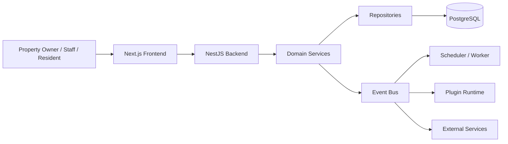
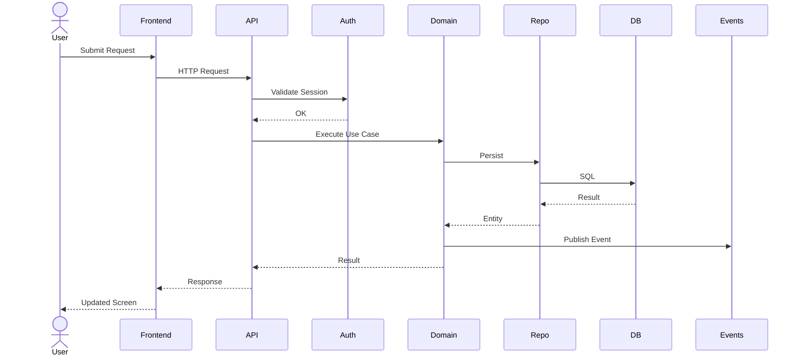
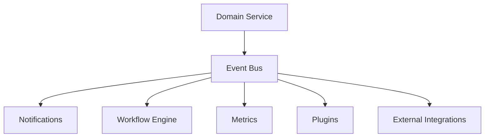
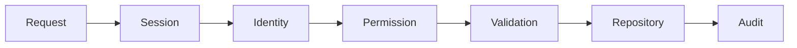

# PropertyOS Platform Architecture

## Overview

PropertyOS is an open-source, modular operating system for properties,
communities, facilities, and related business operations.

The platform combines a Next.js frontend, a NestJS backend, PostgreSQL
persistence, event-driven workflows, background workers, plugins, themes,
and integration services.

---

# Platform Context

---

# Request Flow

---

# Platform Layers

## Frontend

Responsibilities

- Application routing
- Authentication
- Dashboards
- Forms
- Documentation Portal
- Plugin UI
- Theme UI

---

## Backend

Responsibilities

- REST APIs
- Business Logic
- RBAC
- Validation
- Workflow Engine
- Notification Engine
- Plugin Runtime
- Scheduler

---

## Persistence

PropertyOS uses PostgreSQL as the primary transactional datastore.

Repositories isolate SQL implementation from domain services.

---

## Event Driven Architecture

---

# Extension Model

PropertyOS is designed around extensibility.

## Plugins

Backend extensions

- APIs
- Events
- Scheduled jobs
- Permissions
- Integrations

## Themes

Frontend customization

- Branding
- Layout
- Navigation
- Components

## Workflows

Business automation

- Approvals
- Notifications
- Scheduled execution
- Event triggers

---

# Major Domains

Current platform domains include

- Identity & Access
- Property
- Zones
- Spaces
- Tenants
- Leases
- Rent Ledger
- Payments
- Receipts
- Reservations
- Visitors
- Security
- Maintenance
- Helpdesk
- Facilities
- Assets
- Staff
- Vehicles
- Procurement
- Inventory
- Notifications
- Plugins
- Themes

---

# Security Pipeline

---

# Deployment

Typical deployment

- Frontend
- Backend API
- PostgreSQL
- Worker
- Scheduler
- Object Storage
- Reverse Proxy
- Monitoring

---

# Architecture Principles

PropertyOS follows these principles.

- Domain Driven Design
- Modular Architecture
- API First
- Event Driven
- Plugin First
- Theme Driven
- Open Source
- Cloud Native
- Self Hosted
- AI Ready

---

# Architectural Governance

Changes affecting

- APIs
- Domain boundaries
- Database
- Events
- Plugins
- Security
- Deployment

must be documented through Architecture Decision Records (ADRs).

---

# Related Documents

- Product Vision
- Repository Guide
- Documentation Standards
